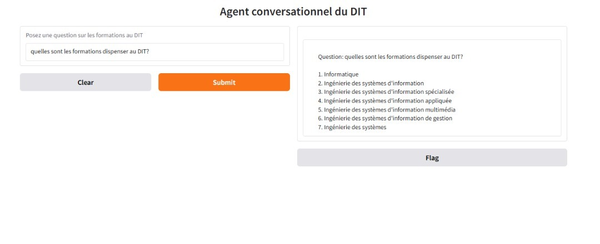

# Agent Conversationnel pour le Dakar Institut de Technologie (DIT)

**dit_assist_chatbot** est un chatbot conçu pour répondre aux questions spécifiques sur les formations offertes par le **Dakar Institut of Technologie (DIT)**. Il s'adresse aux étudiants, enseignants, et futurs apprenants souhaitant des réponses rapides et précises concernant les programmes académiques du DIT.

## Caractéristiques

- **Web Scraping** : Récupération automatique de contenu textuel à partir du site web.
- **Text Chunking** : Division des textes en segments pour un traitement efficace.
- **Recherche sémantique** : Recherche de documents pertinents via une base vectorielle.
- **Réponses contextuelles** : Génération de réponses adaptées à l'aide d'un modèle de langage avancé (Mistral).

## Installation

### Prérequis

- **Python 3.8+ requis**
- Installer les dépendances avec la commande suivante :
  ```bash
 pip install -r requirements.txt

### Demo 

